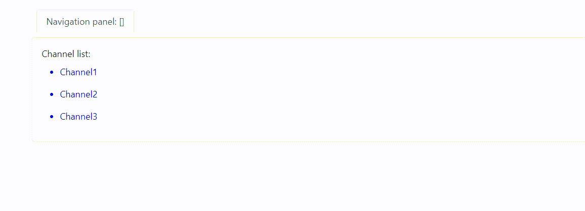

## Reza Mirjahanian

### Setup
 1. Go to the "server" folder and run it.   
 2. In a separate CLI, Go to the "client" folder and run it.
 3. Each folder has a "readme.md" with a detailed explanation.

### Requirements
#### NodeJS backend :
- ✅ Channel and message storage can be an in-memory database (global variable etc).
- ✅ On server start, storage is populated with a fixed set of empty channels
- ✅ GET endpoint for querying channels
- ✅ GET endpoint for querying channel’s messages
- ✅ POST endpoint for submitting new messages to a channel

#### React Client :
- ✅ Render a full page application with three panels
- ✅ Navigation panel shows a list of channels
- ✅ Message list panel shows a list of message bodies for one channel
- ✅ Editor panel shows a text area input
- ✅ Editor panel is hidden if there is no channel selected
- ✅ Editor has a submit button
- ✅ Submit button is disabled if there is no text in message body
- ✅ Clicking a channel in navigation panel selects that channel
- ✅ Entering text in editor and clicking submit adds message to the selected channel
- ✅ Submitting editor clears input
- ✅ Switching channels clears input
- ✅ Channel list is loaded once on loading the application ○ Channel selection
- ✅ Initially no channel is selected
- ✅ There is no upfront loading of messages
- ✅ Messages already in local state are showed immediately
- ✅ Messages are loaded from remote on channel selection and updated to screen
- ✅ Messages are also stored to local state after loading the from remote
- ✅ Upon submitting a message to a channel that message is available for other users
- ✅ Submitting user sees message in message list after submitting
- ✅ Render created message in the list immediately before refreshing from backend